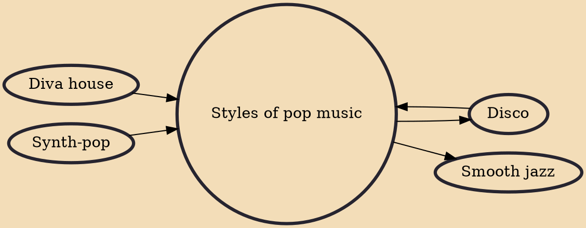

Pop music is a genre of popular music that originated in its modern form during the mid-1950s in the United States and the United Kingdom. The terms popular music and pop music are often used interchangeably, although the former describes all music that is popular and includes many disparate styles. During the 1950s and 1960s, pop music encompassed rock and roll and the youth-oriented styles it influenced. Rock and pop music remained roughly synonymous until the late 1960s, after which pop became associated with music that was more commercial, ephemeral, and accessible.

## Influences

- [[Diva house]]
- [[Disco]]
- [[Synth-pop]]

## Derivatives

- [[Smooth jazz]]
- [[Disco]]
