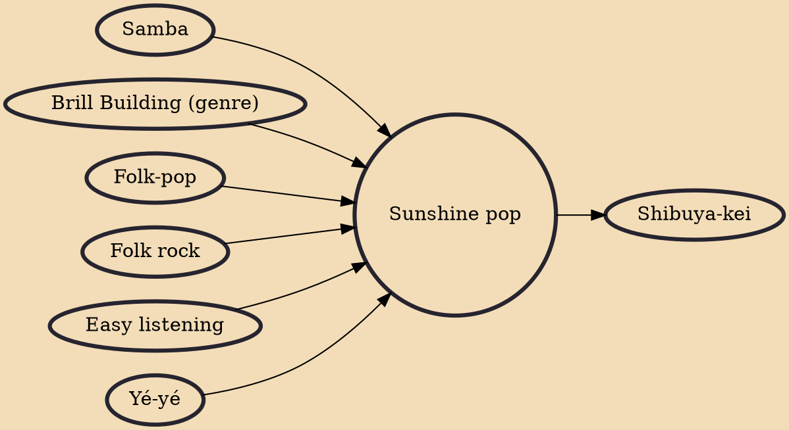

Sunshine pop (originally known as soft pop) is a subgenre of pop music that originated in Southern California in the mid-1960s. Rooted in easy listening and advertising jingles, sunshine pop acts combined nostalgic or anxious moods with "an appreciation for the beauty of the world". It largely consisted of lesser-known artists who imitated more popular groups such as the Mamas & the Papas and the 5th Dimension. While the Beach Boys are noted as prominent influences, the band's own music was rarely representative of the genre.

## Influences

- [[Samba]]
- [[Brill Building (genre)]]
- [[Folk-pop]]
- [[Folk rock]]
- [[Easy listening]]
- [[Yé-yé]]

## Derivatives

- [[Shibuya-kei]]
