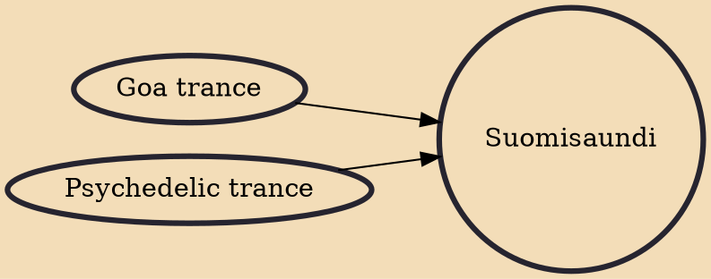

Suomisaundi (English: "Finnish sound"), also known as suomisoundi, suomistyge or spugedelic trance, is a style of psychedelic trance that originated in Finland around the mid-1990s. "Suomisaundi" literally means "Finnish sound" in Finnish. Suomisaundi biggest proponents are said to be Tim Thick and his label Thixx'n'Dixx.

## Influences

- [[Goa trance]]
- [[Psychedelic trance]]
