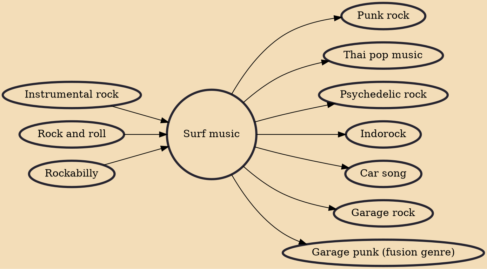

Surf music (or surf rock, surf pop, or surf guitar) is a genre of rock music associated with surf culture, particularly as found in Southern California. It was especially popular from 1958 to 1964 in two major forms. The first is instrumental surf, distinguished by reverb-heavy electric guitars played to evoke the sound of crashing waves, largely pioneered by Dick Dale and the Del-Tones. The second is vocal surf, which took elements of the original surf sound and added vocal harmonies, a movement led by the Beach Boys.

## Influences
- [[Instrumental rock]]
- [[Rock and roll]]
- [[Rockabilly]]

## Derivatives
- [[Punk rock]]
- [[Thai pop music]]
- [[Psychedelic rock]]
- [[Indorock]]
- [[Car song]]
- [[Garage rock]]
- [[Garage punk (fusion genre)]]
