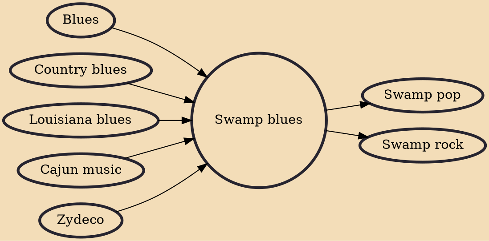

Swamp blues is a type of Louisiana blues that developed in the Black communities of Southwest Louisiana in the 1950s. It incorporates influences from other genres, particularly zydeco and Cajun. Its most successful proponents include Slim Harpo and Lightnin' Slim, who enjoyed national rhythm and blues hits.

## Influences
- [[Blues]]
- [[Country blues]]
- [[Louisiana blues]]
- [[Cajun music]]
- [[Zydeco]]

## Derivatives
- [[Swamp pop]]
- [[Swamp rock]]
