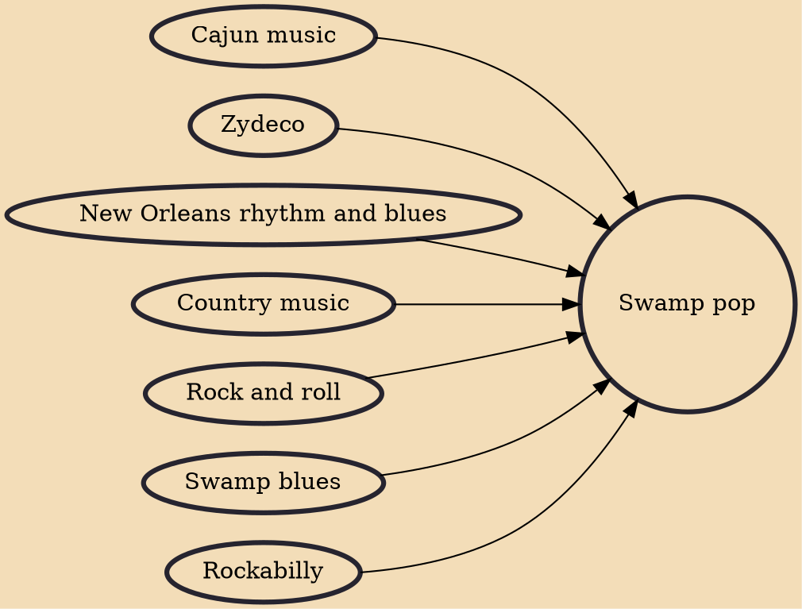

Swamp pop is a music genre indigenous to the Acadiana region of south Louisiana and an adjoining section of southeast Texas. Created in the 1950s by young Cajuns and Creoles, it combines New Orleans–style rhythm and blues, country and western, and traditional French Louisiana musical influences. Although a fairly obscure genre, swamp pop maintains a large audience in its south Louisiana and southeast Texas homeland, and it has acquired a small but passionate cult following in the United Kingdom, and Northern Europe

## Influences
- [[Cajun music]]
- [[Zydeco]]
- [[New Orleans rhythm and blues]]
- [[Country music]]
- [[Rock and roll]]
- [[Swamp blues]]
- [[Rockabilly]]
