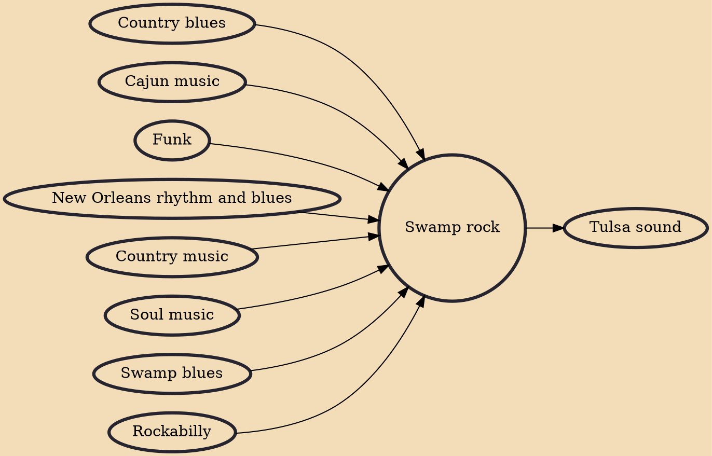

Swamp rock is a genre of rock music that originated in the mid-1960s as a fusion of rockabilly and soul music with swamp blues, country music and funk. The genre originated in Louisiana by artists such as Tony Joe White, but was subsequently popularized by California band Creedence Clearwater Revival.

## Influences
- [[Country blues]]
- [[Cajun music]]
- [[Funk]]
- [[New Orleans rhythm and blues]]
- [[Country music]]
- [[Soul music]]
- [[Swamp blues]]
- [[Rockabilly]]

## Derivatives
- [[Tulsa sound]]
