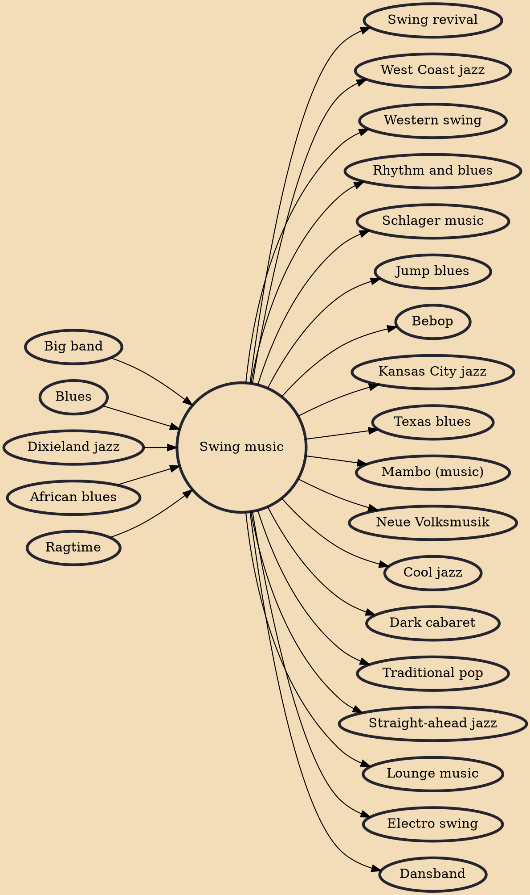

Swing music is a style of jazz that developed in the United States during the late 1920s and early 1930s. It became nationally popular from the mid-1930s. The name derived from its emphasis on the off-beat, or nominally weaker beat. Swing bands usually featured soloists who would improvise on the melody over the arrangement. The danceable swing style of big bands and bandleaders such as Benny Goodman was the dominant form of American popular music from 1935 to 1946, known as the swing era. The verb "to swing" is also used as a term of praise for playing that has a strong groove or drive. Musicians of the swing era include Duke Ellington, Benny Goodman, Count Basie, Cab Calloway, Jimmy Dorsey, Tommy Dorsey, Woody Herman, Harry James, Lionel Hampton, Glenn Miller, Artie Shaw and Django Reinh

## Influences
- [[Big band]]
- [[Blues]]
- [[Dixieland jazz]]
- [[African blues]]
- [[Ragtime]]

## Derivatives
- [[Swing revival]]
- [[West Coast jazz]]
- [[Western swing]]
- [[Rhythm and blues]]
- [[Schlager music]]
- [[Jump blues]]
- [[Bebop]]
- [[Kansas City jazz]]
- [[Texas blues]]
- [[Mambo (music)]]
- [[Neue Volksmusik]]
- [[Cool jazz]]
- [[Dark cabaret]]
- [[Traditional pop]]
- [[Straight-ahead jazz]]
- [[Lounge music]]
- [[Electro swing]]
- [[Dansband]]
