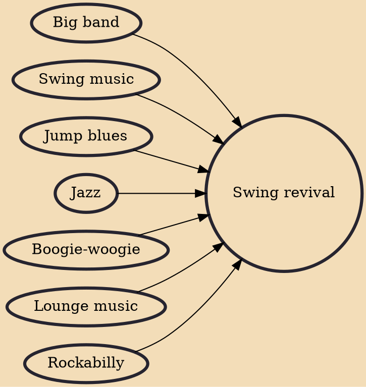

The swing revival, also called retro swing and neo-swing, was a renewed interest in swing music, beginning around 1989 and reaching a peak from the early/mid to late 1990s. The music was generally rooted in the big bands of the swing era of the 1930s and 1940s, but it was also greatly influenced by rockabilly, boogie-woogie, the jump blues of artists such as Louis Prima, and the theatrics of Cab Calloway. Many neo-swing bands practiced contemporary fusions of swing, jazz, and jump blues with rock, punk rock, ska, and ska punk music or had roots in punk, ska, ska punk, and alternative rock music.

## Influences
- [[Big band]]
- [[Swing music]]
- [[Jump blues]]
- [[Jazz]]
- [[Boogie-woogie]]
- [[Lounge music]]
- [[Rockabilly]]
