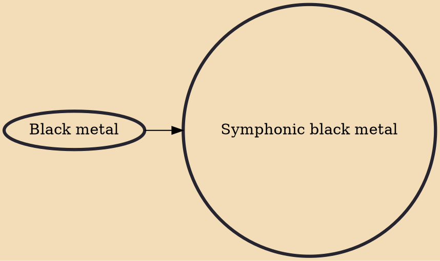

Symphonic black metal is a subgenre of black metal that emerged in the 1990s and incorporates symphonic and orchestral elements. Notable symphonic black metal bands include Cradle Of Filth, Dimmu Borgir, Emperor, and Carach Angren.

## Influences
- [[Black metal]]
