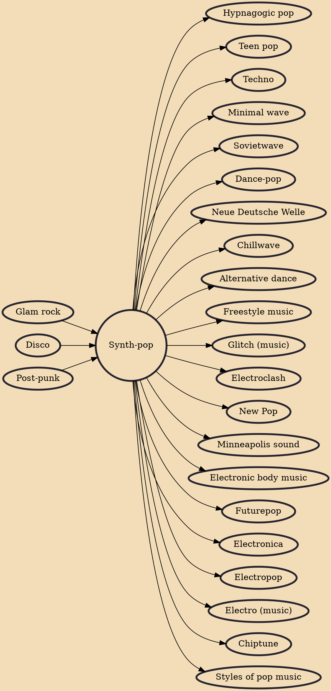

Synth-pop (short for synthesizer pop; also called techno-pop) is a subgenre of new wave music that first became prominent in the late 1970s and features the synthesizer as the dominant musical instrument. It was prefigured in the 1960s and early 1970s by the use of synthesizers in progressive rock, electronic, art rock, disco, and particularly the Krautrock of bands like Kraftwerk. It arose as a distinct genre in Japan and the United Kingdom in the post-punk era as part of the new wave movement of the late 1970s to the mid-1980s.

## Influences
- [[Glam rock]]
- [[Disco]]
- [[Post-punk]]

## Derivatives
- [[Hypnagogic pop]]
- [[Teen pop]]
- [[Techno]]
- [[Minimal wave]]
- [[Sovietwave]]
- [[Dance-pop]]
- [[Neue Deutsche Welle]]
- [[Chillwave]]
- [[Alternative dance]]
- [[Freestyle music]]
- [[Glitch (music)]]
- [[Electroclash]]
- [[New Pop]]
- [[Minneapolis sound]]
- [[Electronic body music]]
- [[Futurepop]]
- [[Electronica]]
- [[Electropop]]
- [[Electro (music)]]
- [[Chiptune]]
- [[Styles of pop music]]
