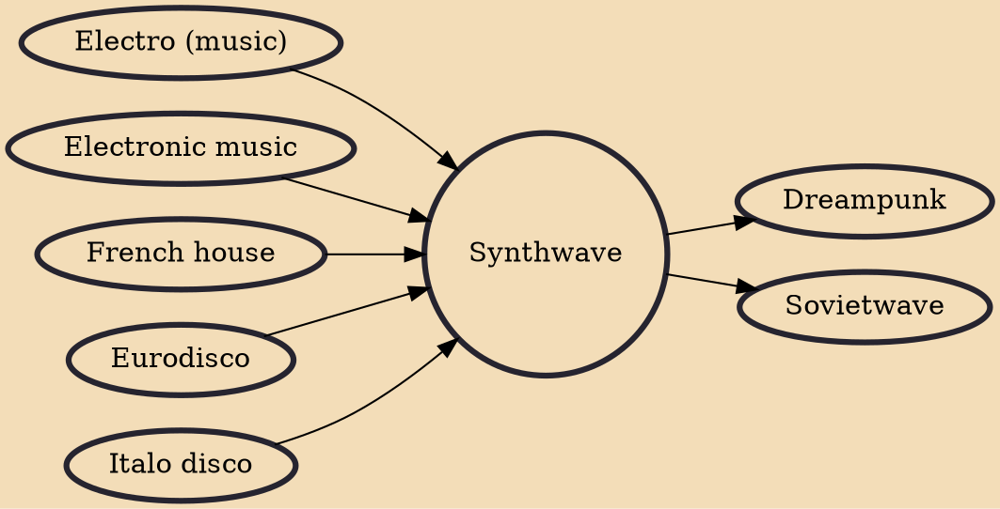

Synthwave (also called outrun, retrowave, or futuresynth) is an electronic music microgenre that is based predominantly on the music associated with action, science-fiction, and horror film soundtracks of the 1980s. Other influences are drawn from the decade's art and video games. Synthwave musicians often espouse nostalgia for 1980s culture and attempt to capture the era's atmosphere and celebrate it.

## Influences

- [[Electro (music)]]
- [[Electronic music]]
- [[French house]]
- [[Eurodisco]]
- [[Italo disco]]

## Derivatives

- [[Dreampunk]]
- [[Sovietwave]]
