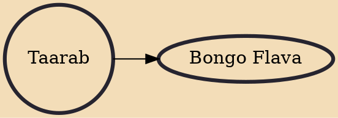

Taarab is a music genre popular in Tanzania and Kenya. It is influenced by the musical traditions of the African Great Lakes, North Africa, the Middle East, and the Indian subcontinent. Taarab rose to prominence in 1928 with the advent of the genre's first star, Siti binti Saad.

## Derivatives

- [[Bongo Flava]]
