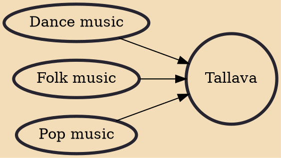

Tallava or Talava is a music genre originating from Albanian-speaking communities in Kosovo as well as in North Macedonia, with a presence in Albania. Having originated in the Roma community in Kosovo in the 1990s, it evokes regional Balkan musical styles (e.g., microtones, vocal glissando, and certain musical instruments) and has become popular in Albania and North Macedonia. It is identified as part of the wider Pop-folk genre of the Southeastern Europe, which includes Chalga from Bulgaria, Skiladiko from Greece, Manele from Romania and Turbo-folk from Serbia.

## Influences

- [[Dance music]]
- [[Folk music]]
- [[Pop music]]
