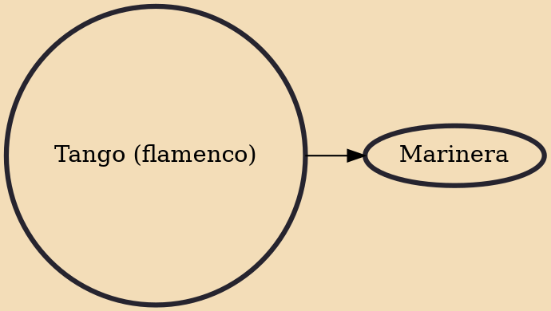

In flamenco a tango (Spanish pronunciation: [ˈtaŋɡo]) is one of the flamenco palos closely related in form and feeling to the rumba flamenca. It is often performed as a finale to a flamenco . Its compás and llamada are the same as that of the farruca and share the farruca's lively nature. However, the tango is normally performed in the A Phrygian mode. In some English sources the flamenco tango is written with an -s; "the tangos is..."

## Derivatives
- [[Marinera]]
