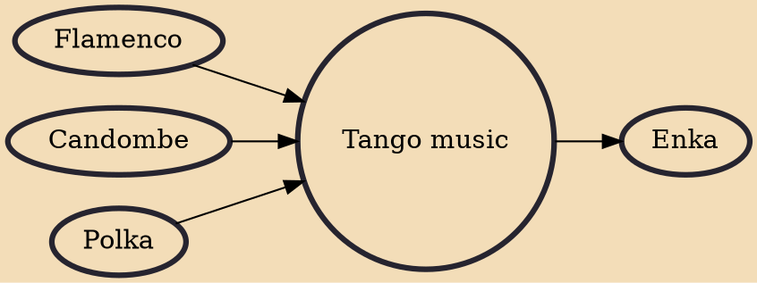

Tango is a style of music in 24 or 44 time that originated among European and African immigrant populations of Argentina and Uruguay (collectively, the "Rioplatenses"). It is traditionally played on a solo guitar, guitar duo, or an ensemble, known as the orquesta típica, which includes at least two violins, flute, piano, double bass, and at least two bandoneóns. Sometimes guitars and a clarinet join the ensemble. Tango may be purely instrumental or may include a vocalist. Tango music and dance have become popular throughout the world.

## Influences
- [[Flamenco]]
- [[Candombe]]
- [[Polka]]

## Derivatives
- [[Enka]]
