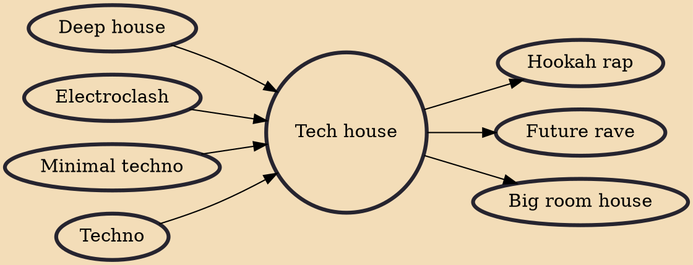

Tech house is a subgenre of house music that combines stylistic features of techno with house. The term tech house developed as a shorthand record store name for a category of electronic dance music that combined musical aspects of techno, such as "rugged basslines" and "steely beats," with the harmonies and grooves of progressive house. The music originally had a clean and minimal production style that was associated with techno from Detroit and the UK.

## Influences
- [[Deep house]]
- [[Electroclash]]
- [[Minimal techno]]
- [[Techno]]

## Derivatives
- [[Hookah rap]]
- [[Future rave]]
- [[Big room house]]
