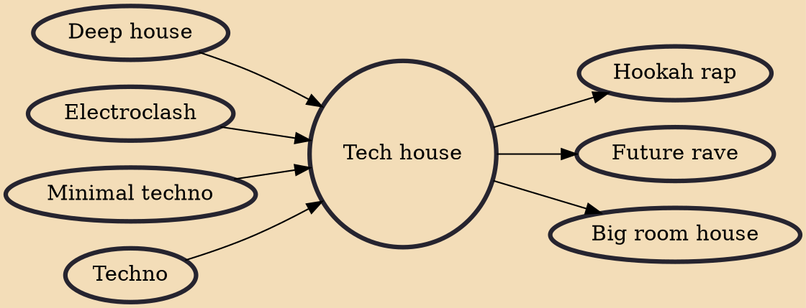

Within the realm of electronic dance music, Tech House has emerged as a captivating hybrid genre that seamlessly blends the mechanical precision of techno with the infectious grooves of house. Born from the marriage of these two distinct styles, Tech House has forged its own path, capturing the hearts of dance music enthusiasts with its dynamic beats, innovative soundscapes, and undeniable allure.

Emerging in the 1990s as a response to the growing popularity of techno and house music, Tech House aimed to strike a balance between the cerebral, hypnotic elements of techno and the soulful, danceable vibes of house. By fusing these two genres, Tech House introduced a new sonic landscape that resonated with both purists and newcomers alike.

Tech House has carved out a distinct place in the electronic music landscape, bridging the gap between the rhythmic euphoria of house and the experimental allure of techno. Its versatility and ability to both ignite dance floors and provoke introspection have cemented its popularity among DJs, producers, and dancers alike. As you delve into the world of Tech House, you'll find yourself drawn into its hypnotic rhythms and innovative sonic textures, experiencing a genre that's as thrilling on the dance floor as it is inspiring in its creativity.

## Key Characteristics

1. Groove-Driven Rhythms: Drawing from its house roots, Tech House is heavily characterized by its infectious and danceable grooves. These rhythmic patterns serve as the backbone of the genre, compelling listeners to move and sway.
2. Minimalistic Aesthetics: Inspired by techno's penchant for stripped-down arrangements, Tech House often embraces minimalism in its sound, focusing on a limited number of elements to create a powerful impact.
3. Techno-Infused Soundscapes: While rooted in house, Tech House incorporates techno's experimental and futuristic soundscapes, resulting in a genre that feels both familiar and cutting-edge.
4. Seamless Transitions: DJs often appreciate Tech House for its versatility, as its groove-focused nature allows for smooth transitions between various electronic music styles during sets.
5. Club and Festival Frenzies: The genre has found its niche in both intimate club settings and sprawling festival stages, adapting its energy to cater to different dance music environments.

## Artists and Tracks

1. Hot Since 82 - "Buggin'": Hot Since 82's track (2018) encapsulates Tech House's blend of infectious groove and electronic innovation, making it a staple in dance floors worldwide.
2. Patrick Topping - "Be Sharp Say Nowt": Known for his energetic and vibrant tracks, Patrick Topping's "Be Sharp Say Nowt" (2017) is a prime example of Tech House's club-friendly sound.
3. Green Velvet, CamelPhat - "Critical": "Critical" (2018) by Green Velvet and CamelPhat showcases the fusion of playful vocals, tech-infused synths, and a propulsive rhythm that defines Tech House.
4. Solardo - "Tribesmen": Solardo's "Tribesmen" (2016) exemplifies the genre's penchant for driving beats, infectious hooks, and captivating sound design.
5. Fisher - "Losing It": Fisher's breakout hit "Losing It" (2018) became an anthem with its infectious groove, vocal sample, and unmistakable Tech House vibe.

## Influences

- [[Deep house]]
- [[Electroclash]]
- [[Minimal techno]]
- [[Techno]]

## Derivatives

- [[Hookah rap]]
- [[Future rave]]
- [[Big room house]]
