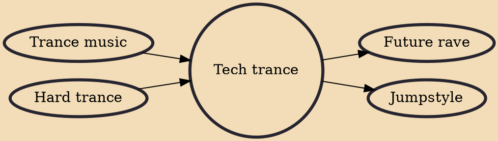

Tech trance, is a subgenre within electronic music that draws upon the techno and trance genres as the name suggests.

## Influences

- [[Trance music]]
- [[Hard trance]]

## Derivatives

- [[Future rave]]
- [[Jumpstyle]]
