```dot
digraph {
	graph [bgcolor="#F3DDB8" rankdir=LR]
	node [color="#26242F" penwidth=3.0]
	Techno [shape=circle]
	"Electro (music)" [URL="/electro-music/"]
	"Electro (music)" -> Techno
	"Electronic body music" [URL="/electronic-body-music/"]
	"Electronic body music" -> Techno
	"Chicago house" [URL="/chicago-house/"]
	"Chicago house" -> Techno
	"Dub music" [URL="/dub-music/"]
	"Dub music" -> Techno
	"Acid house" [URL="/acid-house/"]
	"Acid house" -> Techno
	Eurobeat [URL="/eurobeat/"]
	Eurobeat -> Techno
	"Italo disco" [URL="/italo-disco/"]
	"Italo disco" -> Techno
	"Hi-NRG" [URL="/hi-nrg/"]
	"Hi-NRG" -> Techno
	Krautrock [URL="/krautrock/"]
	Krautrock -> Techno
	"New beat" [URL="/new-beat/"]
	"New beat" -> Techno
	"Synth-pop" [URL="/synth-pop/"]
	"Synth-pop" -> Techno
	Electroclash [URL="/electroclash/"]
	Techno -> Electroclash
	"Glitch (music)" [URL="/glitch-music/"]
	Techno -> "Glitch (music)"
	Jumpstyle [URL="/jumpstyle/"]
	Techno -> Jumpstyle
	"Dub techno" [URL="/dub-techno/"]
	Techno -> "Dub techno"
	"Future rave" [URL="/future-rave/"]
	Techno -> "Future rave"
	Futurepop [URL="/futurepop/"]
	Techno -> Futurepop
	"Lento violento" [URL="/lento-violento/"]
	Techno -> "Lento violento"
	"Future garage" [URL="/future-garage/"]
	Techno -> "Future garage"
	"UK bass" [URL="/uk-bass/"]
	Techno -> "UK bass"
	"Big room house" [URL="/big-room-house/"]
	Techno -> "Big room house"
	"Big beat" [URL="/big-beat/"]
	Techno -> "Big beat"
	"Drill 'n' bass" [URL="/drill-n-bass/"]
	Techno -> "Drill 'n' bass"
	"Progressive house" [URL="/progressive-house/"]
	Techno -> "Progressive house"
	Dreampunk [URL="/dreampunk/"]
	Techno -> Dreampunk
	"Christian electronic dance music" [URL="/christian-electronic-dance-music/"]
	Techno -> "Christian electronic dance music"
	"Bleep techno" [URL="/bleep-techno/"]
	Techno -> "Bleep techno"
	"Outsider house" [URL="/outsider-house/"]
	Techno -> "Outsider house"
	Neurofunk [URL="/neurofunk/"]
	Techno -> Neurofunk
	"Tribal guarachero" [URL="/tribal-guarachero/"]
	Techno -> "Tribal guarachero"
	"Alternative dance" [URL="/alternative-dance/"]
	Techno -> "Alternative dance"
	"Drum and bass" [URL="/drum-and-bass/"]
	Techno -> "Drum and bass"
	"Teen pop" [URL="/teen-pop/"]
	Techno -> "Teen pop"
	Eurodance [URL="/eurodance/"]
	Techno -> Eurodance
	"Tech house" [URL="/tech-house/"]
	Techno -> "Tech house"
	"Vocal trance" [URL="/vocal-trance/"]
	Techno -> "Vocal trance"
	"Birmingham sound" [URL="/birmingham-sound/"]
	Techno -> "Birmingham sound"
	Kuduro [URL="/kuduro/"]
	Techno -> Kuduro
	Hardstyle [URL="/hardstyle/"]
	Techno -> Hardstyle
	Hardvapour [URL="/hardvapour/"]
	Techno -> Hardvapour
	"Coupé-décalé" [URL="/coupe-decale/"]
	Techno -> "Coupé-décalé"
	"Trance music" [URL="/trance-music/"]
	Techno -> "Trance music"
	"Acid techno" [URL="/acid-techno/"]
	Techno -> "Acid techno"
	"Industrial techno" [URL="/industrial-techno/"]
	Techno -> "Industrial techno"
	"Neue Deutsche Härte" [URL="/neue-deutsche-harte/"]
	Techno -> "Neue Deutsche Härte"
	Techstep [URL="/techstep/"]
	Techno -> Techstep
	"Ambient techno" [URL="/ambient-techno/"]
	Techno -> "Ambient techno"
	"Psychedelic trance" [URL="/psychedelic-trance/"]
	Techno -> "Psychedelic trance"
	"Toytown techno" [URL="/toytown-techno/"]
	Techno -> "Toytown techno"
	"Changa tuki" [URL="/changa-tuki/"]
	Techno -> "Changa tuki"
	Nortec [URL="/nortec/"]
	Techno -> Nortec
	"Russ music" [URL="/russ-music/"]
	Techno -> "Russ music"
	Funkot [URL="/funkot/"]
	Techno -> Funkot
}
```

Techno is a genre of electronic dance music (EDM) which is generally produced for use in a continuous DJ set, with tempo often varying between 120 and 150 beats per minute (bpm). The central rhythm is typically in common time (4/4) and often characterized by a repetitive four on the floor beat. Artists may use electronic instruments such as drum machines, sequencers, and synthesizers, as well as digital audio workstations. Drum machines from the 1980s such as Roland's TR-808 and TR-909 are highly prized, and software emulations of such retro instruments are popular.

## Influences

- [[Electro (music)]]
- [[Electronic body music]]
- [[Chicago house]]
- [[Dub music]]
- [[Acid house]]
- [[Eurobeat]]
- [[Italo disco]]
- [[Hi-NRG]]
- [[Krautrock]]
- [[New beat]]
- [[Synth-pop]]

## Derivatives

- [[Electroclash]]
- [[Glitch (music)]]
- [[Jumpstyle]]
- [[Dub techno]]
- [[Future rave]]
- [[Futurepop]]
- [[Lento violento]]
- [[Future garage]]
- [[UK bass]]
- [[Big room house]]
- [[Big beat]]
- [[Drill 'n' bass]]
- [[Progressive house]]
- [[Dreampunk]]
- [[Christian electronic dance music]]
- [[Bleep techno]]
- [[Outsider house]]
- [[Neurofunk]]
- [[Tribal guarachero]]
- [[Alternative dance]]
- [[Drum and bass]]
- [[Teen pop]]
- [[Eurodance]]
- [[Tech house]]
- [[Vocal trance]]
- [[Birmingham sound]]
- [[Kuduro]]
- [[Hardstyle]]
- [[Hardvapour]]
- [[Coupé-décalé]]
- [[Trance music]]
- [[Acid techno]]
- [[Industrial techno]]
- [[Neue Deutsche Härte]]
- [[Techstep]]
- [[Ambient techno]]
- [[Psychedelic trance]]
- [[Toytown techno]]
- [[Changa tuki]]
- [[Nortec]]
- [[Russ music]]
- [[Funkot]]
