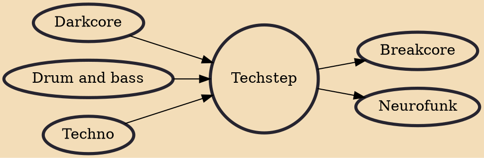

```dot
digraph {
	graph [bgcolor="#F3DDB8" rankdir=LR]
	node [color="#26242F" penwidth=3.0]
	Techstep [shape=circle]
	Darkcore [URL="/darkcore/"]
	Darkcore -> Techstep
	"Drum and bass" [URL="/drum-and-bass/"]
	"Drum and bass" -> Techstep
	Techno [URL="/techno/"]
	Techno -> Techstep
	Breakcore [URL="/breakcore/"]
	Techstep -> Breakcore
	Neurofunk [URL="/neurofunk/"]
	Techstep -> Neurofunk
}
```

Techstep is a dark subgenre of drum and bass that was created in the mid-1990s.

## Influences
- [[Darkcore]]
- [[Drum and bass]]
- [[Techno]]

## Derivatives
- [[Breakcore]]
- [[Neurofunk]]
