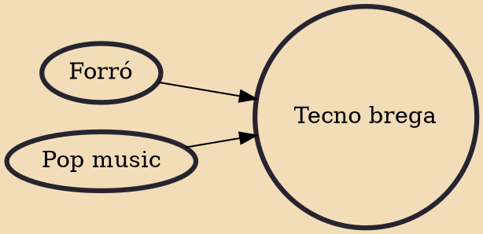

Tecno brega or technobrega (technotacky) is a form of music from northern Brazil, particularly Belém. Music of the genre is created primarily through remixing and reworking songs from popular music and music from the eighties. While there is a large amount of famous music used in tecno brega, the majority of it is original material (80%). Several DJs and music producers from the tecno brega movement were featured in the peer-to-peer filesharing documentary Good Copy Bad Copy.

## Influences

- [[Forró]]
- [[Pop music]]
