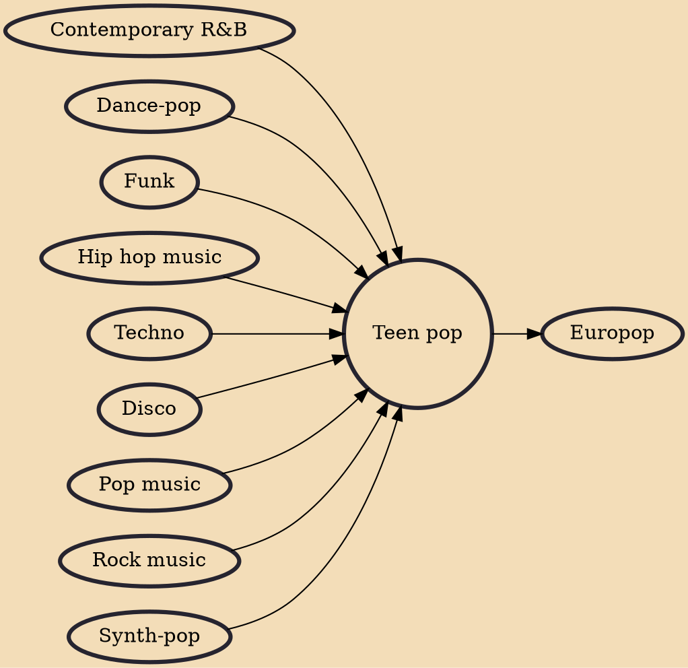

Teen pop is a subgenre of pop music that is created, marketed and oriented towards preteens and teenagers. Teen pop incorporates different subgenres of pop music, as well as elements of R&B, dance, electronic, hip hop and rock, while the music of girl groups, boy bands, and acts like Britney Spears, is sometimes referred to as pure pop. Typical characteristics of teen pop music include Auto-Tuned or pitch-corrected vocals, choreographed dances, emphasis on visual appeal (photogenic faces, unique body physiques, immaculate hair styles and fashion clothes), lyrics focused on love, relationships, dancing, partying, friendship, puppy love (also known as a "crush") and repeated chorus lines. Its lyrics also incorporate sexual innuendo. Teen pop singers often cultivate an image of a girl next do

## Influences

- [[Contemporary R&B]]
- [[Dance-pop]]
- [[Funk]]
- [[Hip hop music]]
- [[Techno]]
- [[Disco]]
- [[Pop music]]
- [[Rock music]]
- [[Synth-pop]]

## Derivatives

- [[Europop]]
