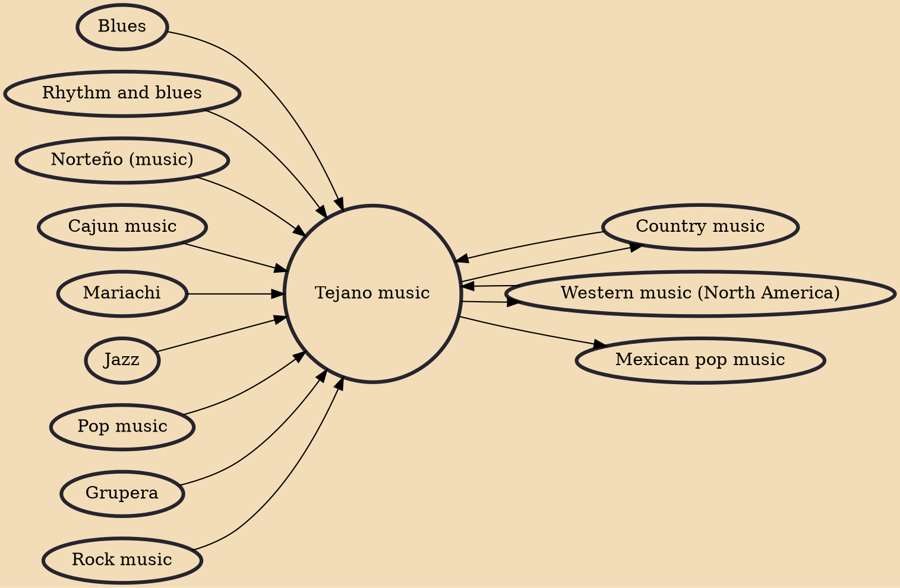

Tejano music (Spanish: música tejana), also known as Tex-Mex music, is a popular music style fusing Mexican and US influences. Typically, Tejano combines Mexican Spanish vocal styles with dance rhythms from Czech and German genres – particularly polka or waltz. Tejano music is traditionally played by small groups featuring accordion and guitar or bajo sexto. Its evolution began in northern Mexico (a variation known as norteño).

## Influences
- [[Blues]]
- [[Rhythm and blues]]
- [[Norteño (music)]]
- [[Cajun music]]
- [[Mariachi]]
- [[Jazz]]
- [[Country music]]
- [[Western music (North America)]]
- [[Pop music]]
- [[Grupera]]
- [[Rock music]]

## Derivatives
- [[Western music (North America)]]
- [[Country music]]
- [[Mexican pop music]]
