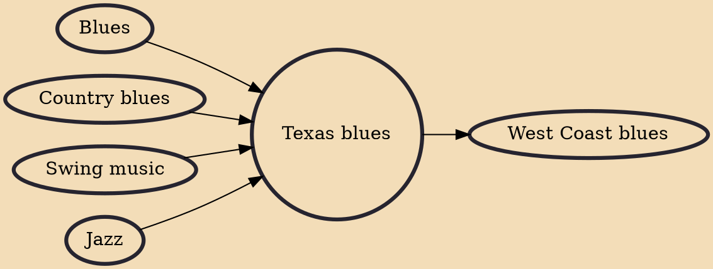

Texas blues is blues music from Texas. As a regional style, its original form was characterized by jazz and swing influences. Later examples are often closer to blues rock and Southern rock.

## Influences

- [[Blues]]
- [[Country blues]]
- [[Swing music]]
- [[Jazz]]

## Derivatives

- [[West Coast blues]]
