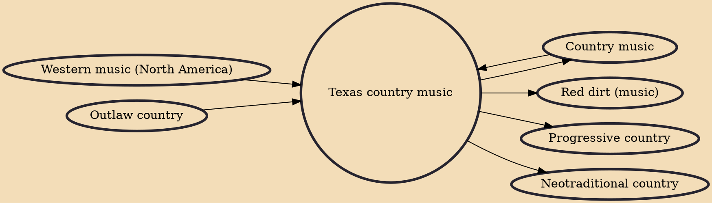

Texas country music (more popularly known just as Texas country or Texas music) is a rapidly growing subgenre of country music from Texas. Texas country is a unique style of Western music and is often associated with other distinct neighboring styles, including Red Dirt from Oklahoma, the New Mexico music of New Mexico, and Tejano in Texas, all of which have influenced one another over the years, and are popular throughout Texas, the Midwest, the Southwest, and other parts of the Western United States. Texas Country is known for fusing neotraditional country with the outspoken, care-free views of outlaw country. Texas Country blends these sub-genres with a "common working man" theme and witty undertones, these often combine with a stripped down music sound.

## Influences

- [[Country music]]
- [[Western music (North America)]]
- [[Outlaw country]]

## Derivatives

- [[Country music]]
- [[Red dirt (music)]]
- [[Progressive country]]
- [[Neotraditional country]]
