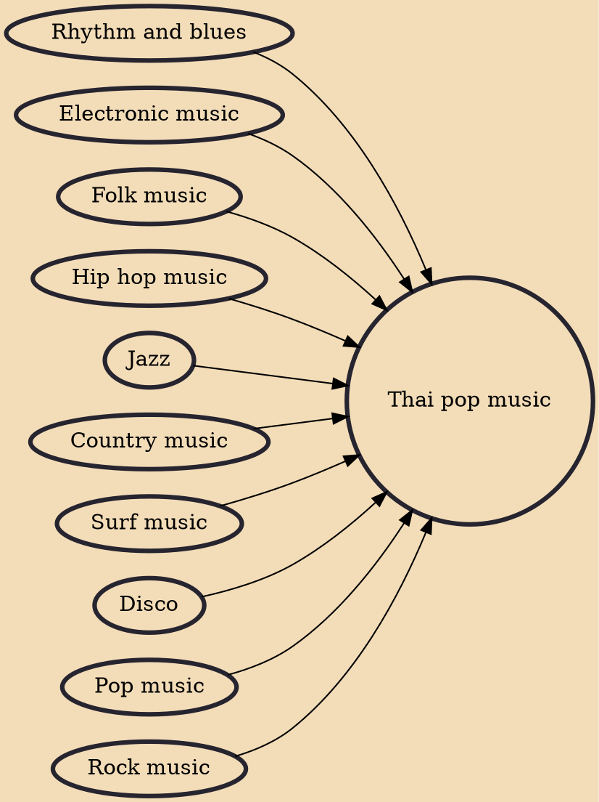

Thai pop or T-pop, is a genre of Thai music roughly equivalent to western pop. It emerged in the 1970s–80s, during which it was known as string music (Thai: เพลงสตริง), before gaining mainstream popularity during the 1990s and has since dominated the Thai music industry. The term is extremely broad, covering Thai rock, dance music, rap and western-influenced popular music in general, though normally excluding the folk and rock-influenced phleng phuea chiwit.

## Influences
- [[Rhythm and blues]]
- [[Electronic music]]
- [[Folk music]]
- [[Hip hop music]]
- [[Jazz]]
- [[Country music]]
- [[Surf music]]
- [[Disco]]
- [[Pop music]]
- [[Rock music]]
