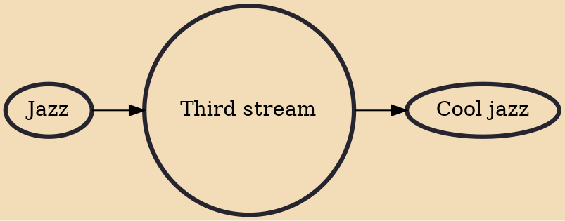

Third stream is a music genre that is a fusion of jazz and classical music. The term was coined in 1957 by composer Gunther Schuller in a lecture at Brandeis University. Improvisation is generally seen as a vital component of third stream.

## Influences

- [[Jazz]]

## Derivatives

- [[Cool jazz]]
