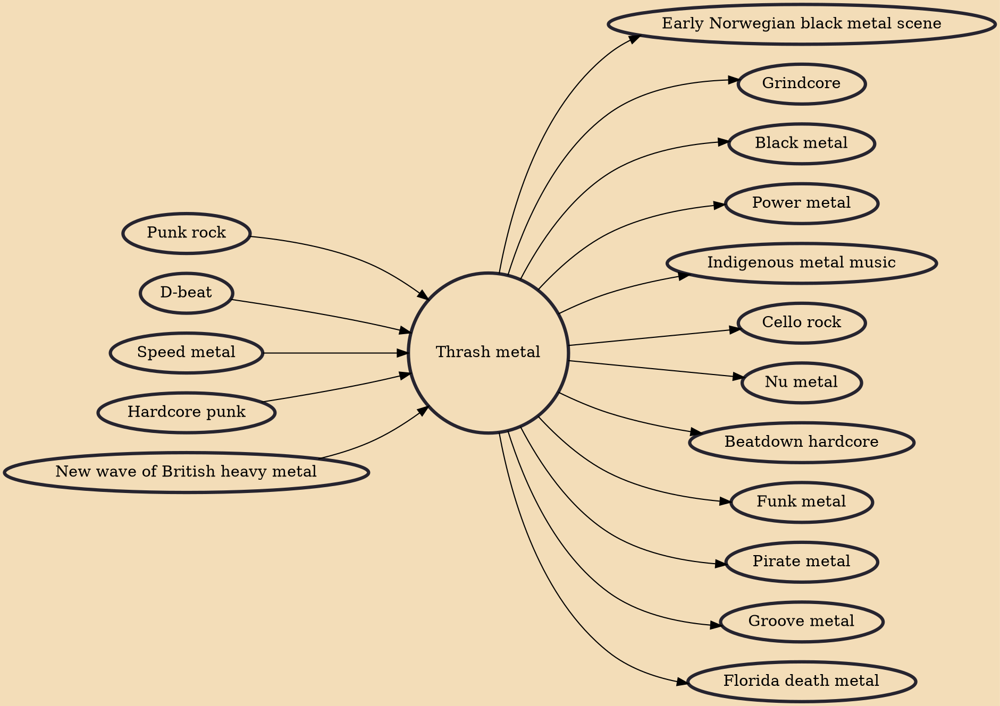

Thrash metal (or simply thrash) is an extreme subgenre of heavy metal music characterized by its overall aggression and often fast tempo. The songs usually use fast percussive beats and low-register guitar riffs, overlaid with shredding-style lead guitar work. The lyrical subject matter often includes criticism of The Establishment and concern over environmental destruction, and at times shares a disdain for Christian dogma with that of black metal. The language is typically direct and denunciatory, an approach borrowed from hardcore punk.

## Influences

- [[Punk rock]]
- [[D-beat]]
- [[Speed metal]]
- [[Hardcore punk]]
- [[New wave of British heavy metal]]

## Derivatives

- [[Early Norwegian black metal scene]]
- [[Grindcore]]
- [[Black metal]]
- [[Power metal]]
- [[Indigenous metal music]]
- [[Cello rock]]
- [[Nu metal]]
- [[Beatdown hardcore]]
- [[Funk metal]]
- [[Pirate metal]]
- [[Groove metal]]
- [[Florida death metal]]
