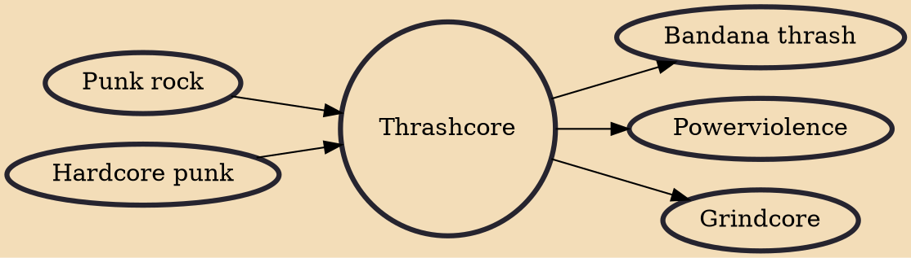

Thrashcore (also known as fastcore) is a fast-tempo subgenre of hardcore punk that emerged in the early 1980s. Thrashcore is essentially sped-up hardcore, often using blast beats. Songs can be very brief, and thrashcore is in many ways a less dissonant, less metallic forerunner of grindcore. The genre is sometimes associated with the skateboarder subculture.

## Influences
- [[Punk rock]]
- [[Hardcore punk]]

## Derivatives
- [[Bandana thrash]]
- [[Powerviolence]]
- [[Grindcore]]
