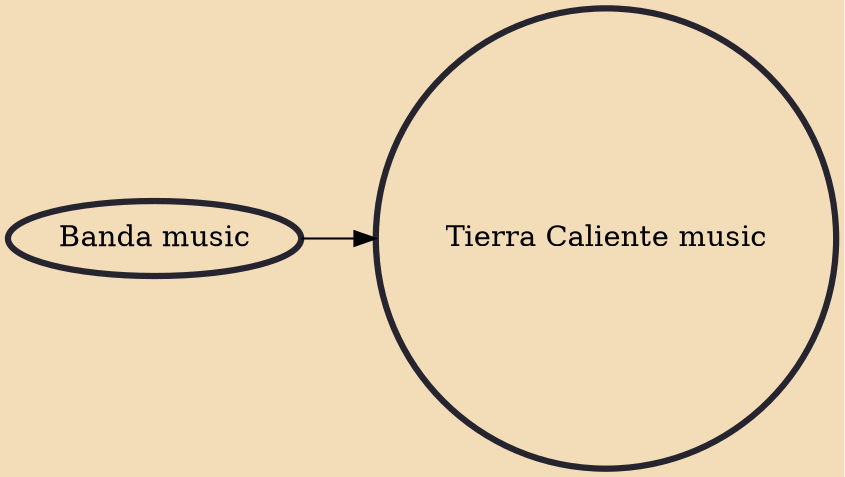

```dot
digraph {
	graph [bgcolor="#F3DDB8" rankdir=LR]
	node [color="#26242F" penwidth=3.0]
	"Tierra Caliente music" [shape=circle]
	"Banda music" [URL="/banda-music/"]
	"Banda music" -> "Tierra Caliente music"
}
```

Tierra Caliente music (música de Tierra Caliente in Spanish) is a genre of Regional Mexican music.

## Influences
- [[Banda music]]
