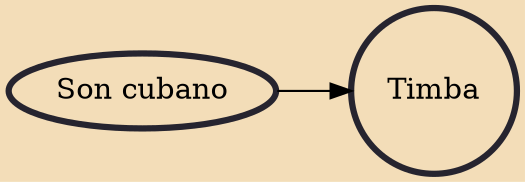

Timba is a Cuban genre of music based on Cuban son with salsa, American Funk/R&B and the strong influence of Afro-Cuban folkloric music. Timba rhythm sections differ from their salsa counterparts, because timba emphasizes the bass drum, which is not used in salsa bands. Timba and salsa use the same tempo range and they both use the standard conga marcha. Almost all timba bands have a trap drummer. Timbas also often break the basic tenets of arranging the music in-clave. Timba is considered to be a highly aggressive type of music, with rhythm and "swing" taking precedence over melody and lyricism. Associated with timba is a radically sexual and provocative dance style known as (literally meaning chaos or frenzy). It is a dynamic evolution of salsa, full of improvisation and Afro Cuban heri

## Influences

- [[Son cubano]]
