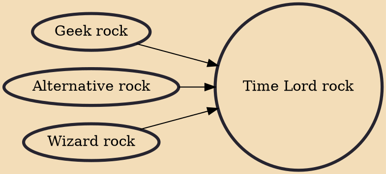

Time Lord rock (sometimes shortened to Trock) is a genre of geek rock music based on, and about, the Doctor Who television series. It was created in 2008 in the United Kingdom with the formation of Chameleon Circuit.

## Influences

- [[Geek rock]]
- [[Alternative rock]]
- [[Wizard rock]]
