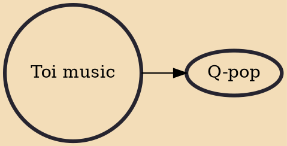

```dot
digraph {
	graph [bgcolor="#F3DDB8" rankdir=LR]
	node [color="#26242F" penwidth=3.0]
	"Toi music" [shape=circle]
	"Q-pop" [URL="/q-pop/"]
	"Toi music" -> "Q-pop"
}
```

Toi music (Той) is a genre of popular folk music originated from Central Asia. This genre of music is popular in countries like Uzbekistan, Kazakhstan and Kyrgyzstan.

## Derivatives
- [[Q-pop]]
