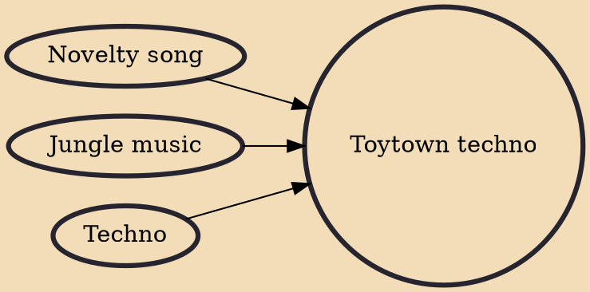

Toytown techno (also known as kiddy rave or cartoon rave) is an underground subgenre of techno that emerged in the early 1990s, characterized by merging techno, jungle, or breakbeat hardcore with samples from children's programs or public information films. Popular songs within the subgenre include Mark Summers' "Summers Magic", Smart E's "Sesame's Treet", the Prodigy's "Charly", Shaft's "Roobarb and Custard" and Urban Hype's "A Trip to Trumpton", which featured samples from The Magic Roundabout, Sesame Street, Charley Says, Roobarb and Trumpton, respectively.

## Influences
- [[Novelty song]]
- [[Jungle music]]
- [[Techno]]
