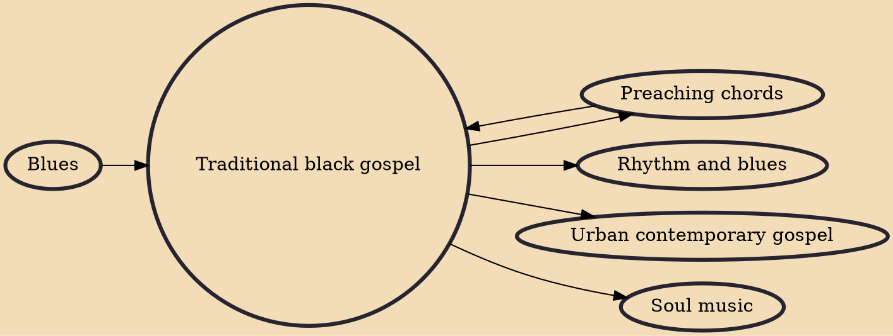

Traditional Black gospel is music that is written to express either personal or a communal belief regarding African American Christian life, as well as (in terms of the varying music styles) to give a Christian alternative to mainstream secular music. It is a form of Christian music and a subgenre of Black gospel music. Traditional gospel music was popular in the mid-20th century. It is the primary source for urban contemporary gospel and Christian hip hop, which rose in popularity during the late 20th century and early 21st century.

## Influences

- [[Preaching chords]]
- [[Blues]]

## Derivatives

- [[Rhythm and blues]]
- [[Urban contemporary gospel]]
- [[Soul music]]
- [[Preaching chords]]
