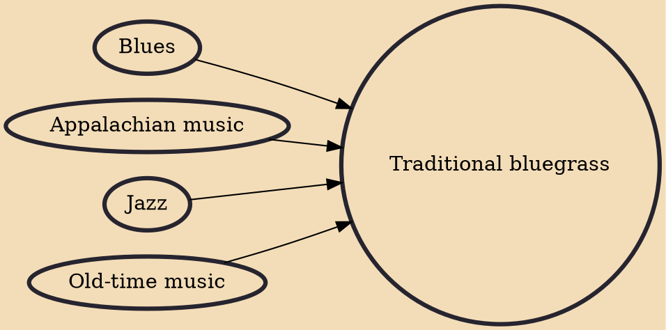

Traditional bluegrass, as the name implies, emphasizes the traditional elements of bluegrass music, and stands in contrast to progressive bluegrass. Traditional bluegrass musicians play folk songs, tunes with simple traditional chord progressions, and on acoustic instruments of a type that were played by bluegrass pioneer Bill Monroe and his Blue Grass Boys band in the late 1940s. Traditional bands may use their instruments in slightly different ways, for example by using multiple guitars or fiddles in a band.

## Influences

- [[Blues]]
- [[Appalachian music]]
- [[Jazz]]
- [[Old-time music]]
