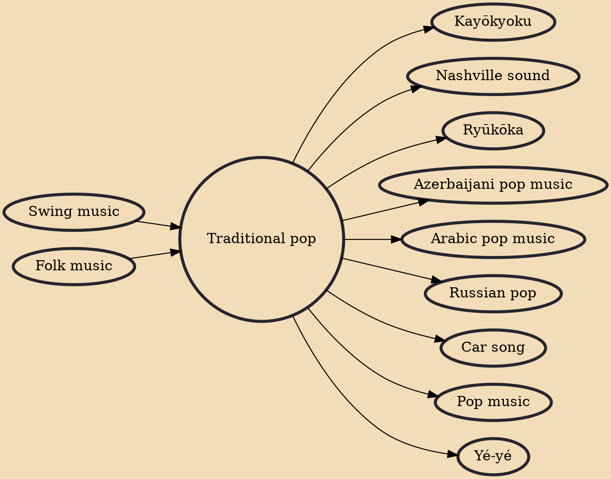

Traditional pop (also known as classic pop and pre-rock and roll pop) is Western pop music that generally pre-dates the advent of rock and roll in the mid-1950s. The most popular and enduring songs from this era of music are known as pop standards or American standards. The works of these songwriters and composers are usually considered part of the canon known as the "Great American Songbook". More generally, the term "standard" can be applied to any popular song that has become very widely known within mainstream culture.

## Influences
- [[Swing music]]
- [[Folk music]]

## Derivatives
- [[Kayōkyoku]]
- [[Nashville sound]]
- [[Ryūkōka]]
- [[Azerbaijani pop music]]
- [[Arabic pop music]]
- [[Russian pop]]
- [[Car song]]
- [[Pop music]]
- [[Yé-yé]]
