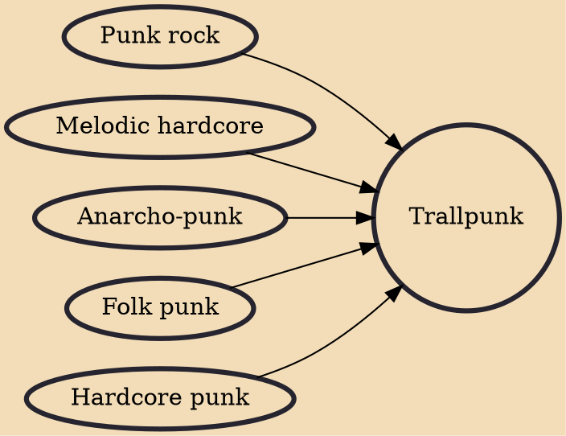

Trallpunk (Swedish; roughly translates to 'melodious punk' — see the Wiktionary entry) is a subgenre of punk music developed in Sweden. It is known for its fast drums, a melodic sound, and often politically oriented lyrics. Generally, Asta Kask is considered to be one of the first trallpunk bands. During the 1990s, trallpunk saw increased popularity, particularly due to the club Kafé 44 in Stockholm and the band De Lyckliga Kompisarna (The Happy Friends).

## Influences

- [[Punk rock]]
- [[Melodic hardcore]]
- [[Anarcho-punk]]
- [[Folk punk]]
- [[Hardcore punk]]
