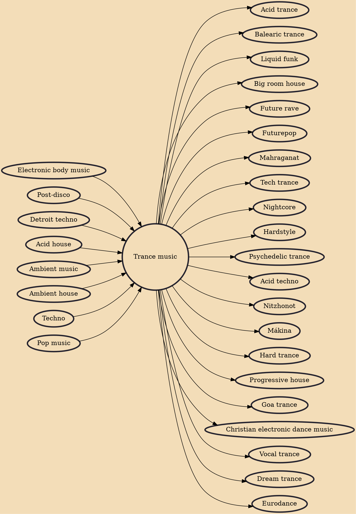

Trance music, with its ethereal melodies, euphoric builds, and hypnotic rhythms, has captivated the hearts and minds of electronic music enthusiasts around the world. Emerging as a distinct genre in the 1990s, Trance has evolved into a multifaceted genre that takes listeners on an emotional and transformative journey, characterized by its dreamlike atmospheres and powerful crescendos.

Trance music was born in the fertile electronic music landscape of the late 1980s and early 1990s. It originated as a fusion of various electronic styles, including house, techno, and ambient music. The genre's name itself reflects its intention to induce a trance-like state in listeners through its repetitive and entrancing beats.

Trance music invites listeners to embark on an enchanting journey of sound and emotion, transcending the ordinary and evoking a sense of euphoria. Its melodic allure, uplifting energy, and progressive arrangements have turned it into a global phenomenon that continues to unite dance floors and festivals with its transformative power. As you delve into the world of Trance, you'll find yourself immersed in a sonic universe where melodies intertwine with emotions, creating an experience that is both captivating and unforgettable.

## Key Characteristics

1. Melodic Embrace: At the heart of Trance lies its emotive and melodic nature. Lush and captivating melodies take center stage, invoking deep feelings and connecting listeners on a profound level.
2. Progressive Builds: Trance tracks are often characterized by gradual and progressive build-ups, where layers of sound are added over time to create a sense of anticipation and euphoria.
3. Uplifting Energy: A prevailing feature of Trance is its ability to evoke a sense of euphoria and upliftment. The music's soaring melodies and climactic drops create an emotional peak that resonates with listeners.
4. Extended Arrangements: Trance tracks often feature extended arrangements, allowing for longer journeys through evolving soundscapes that immerse the listener in a state of sonic reverie.
5. Vocal Elements: Vocal samples and uplifting lyrics frequently appear in Trance, adding a human touch to the genre's dreamlike quality and enhancing its emotional impact.

## Artists and Tracks

1. Armin van Buuren - "Communication": Armin van Buuren's "Communication" (1999) is a Trance anthem that perfectly encapsulates the genre's emotional melodies and progressive builds.
2. Above & Beyond - "Sun & Moon": Known for their emotive sound, Above & Beyond's "Sun & Moon" (2011) features touching lyrics and a melodic arrangement that embodies Trance's essence.
3. Paul van Dyk - "For an Angel": Paul van Dyk's "For an Angel" (1994) is a timeless classic that exemplifies the genre's ability to transport listeners to a trance-like state through its melodic progression.
4. Tiësto - "Adagio for Strings": Tiësto's reimagining of Samuel Barber's "Adagio for Strings" (2005) showcases Trance's ability to infuse classical elements into its dynamic sound.
5. Ferry Corsten - "Punk": "Punk" (2002) by Ferry Corsten is a high-energy track that captures Trance's infectious beats and euphoric energy.
6. Aly & Fila - "We Control The Sunlight": Aly & Fila's "We Control The Sunlight" (2011) is an example of uplifting Trance that combines melodic beauty with driving rhythms.

## Influences

- [[Electronic body music]]
- [[Post-disco]]
- [[Detroit techno]]
- [[Acid house]]
- [[Ambient music]]
- [[Ambient house]]
- [[Techno]]
- [[Pop music]]

## Derivatives

- [[Acid trance]]
- [[Uplifting Trance]]
- [[Balearic trance]]
- [[Liquid funk]]
- [[Big room house]]
- [[Future rave]]
- [[Futurepop]]
- [[Mahraganat]]
- [[Tech trance]]
- [[Nightcore]]
- [[Hardstyle]]
- [[Psychedelic trance]]
- [[Acid techno]]
- [[Nitzhonot]]
- [[Mákina]]
- [[Hard trance]]
- [[Progressive house]]
- [[Goa trance]]
- [[Christian electronic dance music]]
- [[Vocal trance]]
- [[Dream trance]]
- [[Eurodance]]
