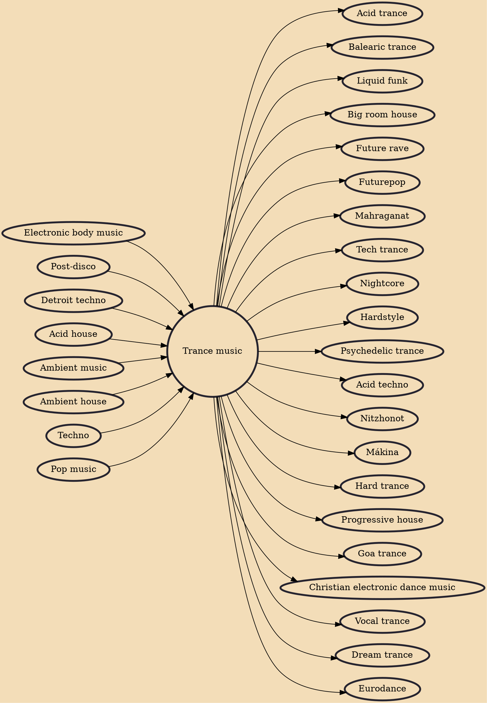

Trance is a genre of electronic dance music that emerged from the British new-age music scene and the early 1990s German techno and hardcore scenes. Trance music is characterized by a tempo generally lying between 135–150 beats per minute (BPM), repeating melodic phrases and a musical form that distinctly builds tension and elements throughout a track often culminating in 1 to 2 "peaks" or "drops". Although trance is a genre of its own, it liberally incorporates influences from other musical styles such as techno, house, pop, chill-out, classical music, tech house, ambient and film music.

## Influences
- [[Electronic body music]]
- [[Post-disco]]
- [[Detroit techno]]
- [[Acid house]]
- [[Ambient music]]
- [[Ambient house]]
- [[Techno]]
- [[Pop music]]

## Derivatives
- [[Acid trance]]
- [[Balearic trance]]
- [[Liquid funk]]
- [[Big room house]]
- [[Future rave]]
- [[Futurepop]]
- [[Mahraganat]]
- [[Tech trance]]
- [[Nightcore]]
- [[Hardstyle]]
- [[Psychedelic trance]]
- [[Acid techno]]
- [[Nitzhonot]]
- [[Mákina]]
- [[Hard trance]]
- [[Progressive house]]
- [[Goa trance]]
- [[Christian electronic dance music]]
- [[Vocal trance]]
- [[Dream trance]]
- [[Eurodance]]
