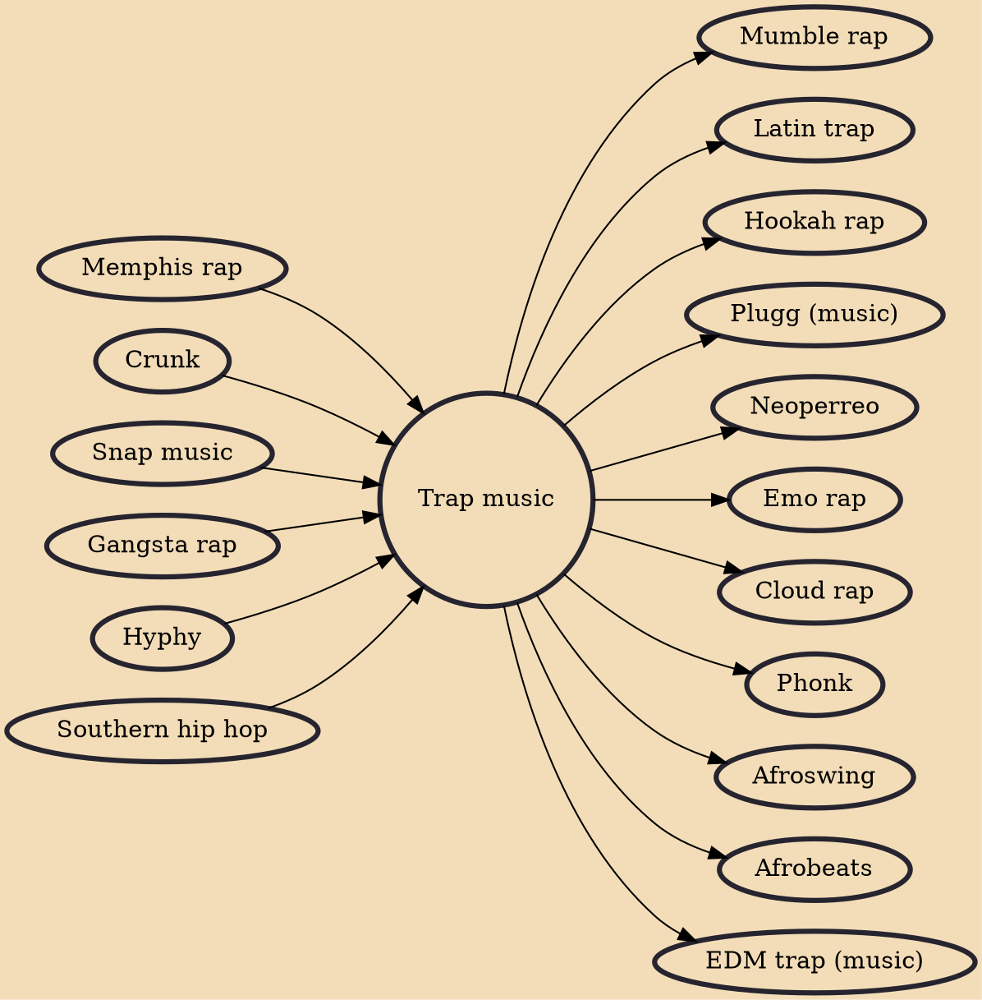

Trap is a subgenre of hip hop music that originated in the Southern United States during the 1990s. The genre gets its name from the Atlanta slang word "trap", a house used exclusively to sell drugs. Trap music uses synthesized drums and is characterized by complex hi-hat patterns, tuned kick drums with a long decay (originally from the Roland TR-808 drum machine), and lyrical content that often focuses on drug use and urban violence. It utilizes very few instruments and focuses almost exclusively on snare drums and double- or triple-timed hi-hats.

## Influences

- [[Memphis rap]]
- [[Crunk]]
- [[Snap music]]
- [[Gangsta rap]]
- [[Hyphy]]
- [[Southern hip hop]]

## Derivatives

- [[Mumble rap]]
- [[Latin trap]]
- [[Hookah rap]]
- [[Plugg (music)]]
- [[Neoperreo]]
- [[Emo rap]]
- [[Cloud rap]]
- [[Phonk]]
- [[Afroswing]]
- [[Afrobeats]]
- [[EDM trap (music)]]
