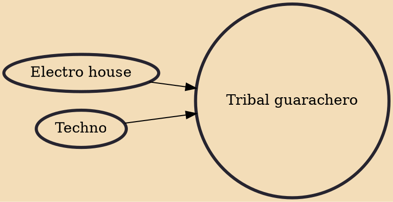

Tribal guarachero, also known as trival, is a music genre that fuses electronic dance music with cumbia or certain rhythms from regional Mexican music genres. Tribal guarachero is sometimes referred to as "3ball". Despite the similarity between the letter "b" and "v" in Spanish, it should not be confused with tribal house or tecnocumbia music.

## Influences
- [[Electro house]]
- [[Techno]]
