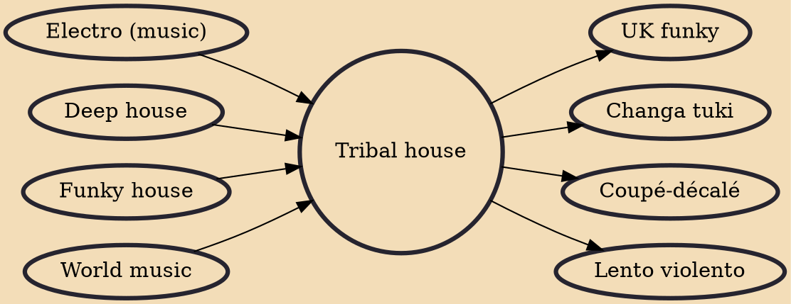

Tribal house is a subgenre of house music which combines traditional house music with world music. It is broadly characterized by elements of indigenous musical percussions (typically conga drums or its synthesized derivative).

## Influences

- [[Electro (music)]]
- [[Deep house]]
- [[Funky house]]
- [[World music]]

## Derivatives

- [[UK funky]]
- [[Changa tuki]]
- [[Coupé-décalé]]
- [[Lento violento]]
