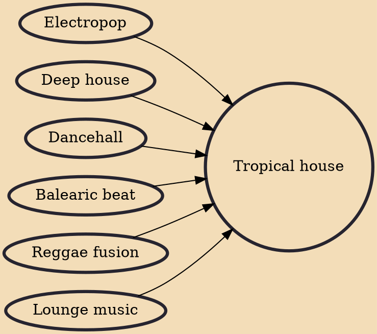

Tropical house, also known as trop house, is a subgenre of house music, and a derivation of tropical music, with elements of dancehall and Balearic house. Artists of the genre are often featured at various summer festivals such as Tomorrowland. The genre was popularized by artists including Thomas Jack, Kygo, Matoma, Lost Frequencies, Seeb and Gryffin.

## Influences

- [[Electropop]]
- [[Deep house]]
- [[Dancehall]]
- [[Balearic beat]]
- [[Reggae fusion]]
- [[Lounge music]]
