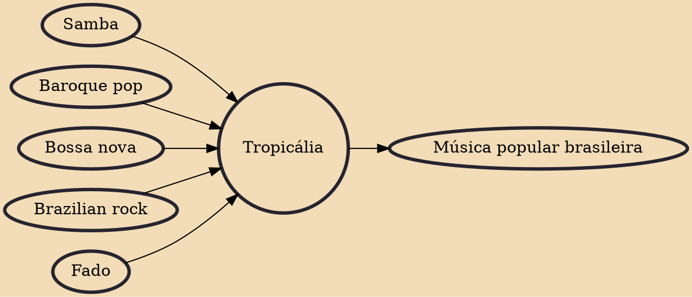

Tropicália (Portuguese pronunciation: [tɾopiˈkaʎɐ, tɾɔpiˈkaljɐ]), also known as Tropicalismo ([tɾopikɐˈlizmu, tɾɔpikaˈ-]), was a Brazilian artistic movement that arose in the late 1960s. It was characterized by the amalgamation of Brazilian genres—notably the union of the popular and the avant-garde, as well as the melding of Brazilian tradition and foreign traditions and styles. Today, Tropicália is chiefly associated with the musical faction of the movement, which merged Brazilian and African rhythms with British and American psychedelia and pop rock. The movement also included works of film, theatre, and poetry.

## Influences

- [[Samba]]
- [[Baroque pop]]
- [[Bossa nova]]
- [[Brazilian rock]]
- [[Fado]]

## Derivatives

- [[Música popular brasileira]]
