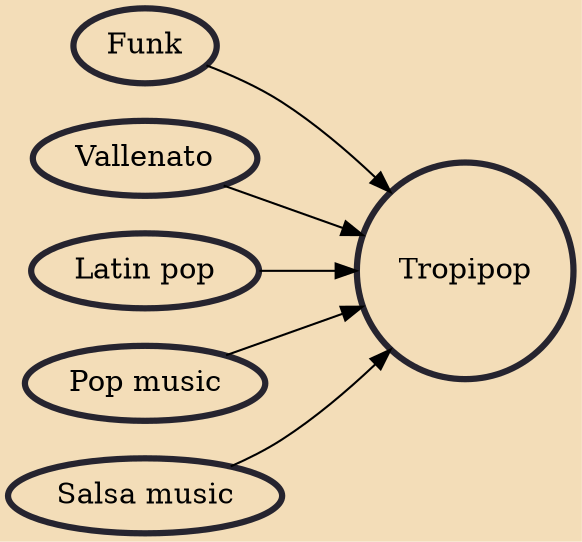

Tropipop (also known as Colombian pop and Trop-pop) is a music genre that developed in Colombia in the late 1990s and early 2000s. It is a blend of traditional musical forms of the Caribbean Region of Colombia, mainly vallenato, with foreign Latin genres such as salsa and merengue, and pop and pop rock. The term "tropipop" comes from the synthesis of the words "tropical" and "pop music" describing the genre's mix of Latin tropical roots with American popular music.

## Influences
- [[Funk]]
- [[Vallenato]]
- [[Latin pop]]
- [[Pop music]]
- [[Salsa music]]
