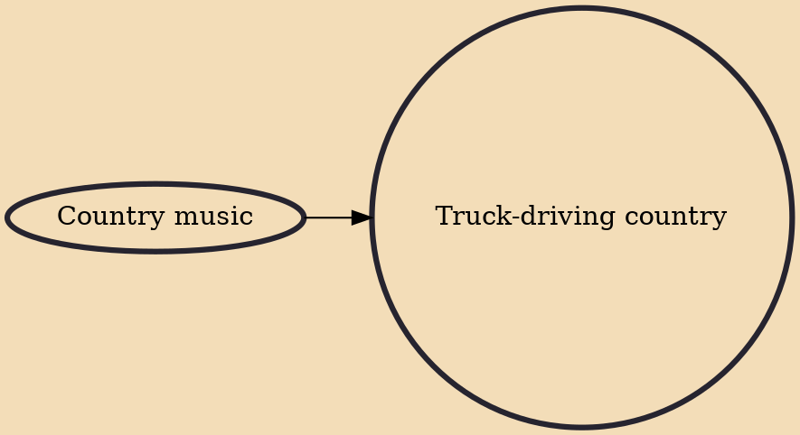

Truck-driving country is a subgenre of country and western music. It is characterized by lyrical content about trucks (i.e. commercial vehicles, not pick-up trucks), truck drivers or truckers, and the trucking industry experience. This includes, for example, references to truck stops, CB radio, trucker jokes, attractive women, romance, heartbreak, loneliness, stimulants and eugeroics, teamsters, roads and highways, billboards, inclement weather, traffic, ICC, DOT, car accidents, washrooms, etc. In truck-driving country, references to "truck" include the following truck types: 10 wheeler, straight truck, 18 wheeler, tractor (bobtail), semi, tractor-trailer, semi tractor trailer, big rig, and some others. Truck-driving country musicians include Dave Dudley, Red Sovine, Dick Curless, Red Simp

## Influences

- [[Country music]]
