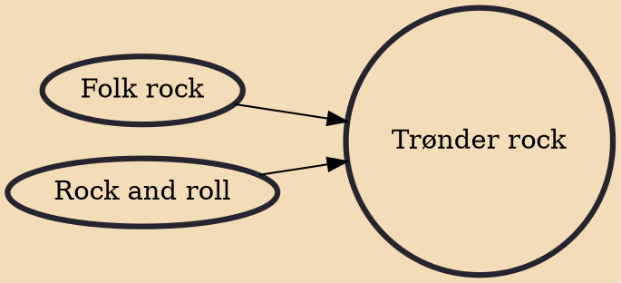

Trønder rock (Norwegian: trønderrock) is a music and cultural scene developed in the Trøndelag region of Norway in the early 1970s, in which bands and artists merged folk rock inspired rock and roll with cultural characteristics. Today, the term has gained some further use, and is often used as a general term for artists and bands associated with Trøndelag.

## Influences
- [[Folk rock]]
- [[Rock and roll]]
