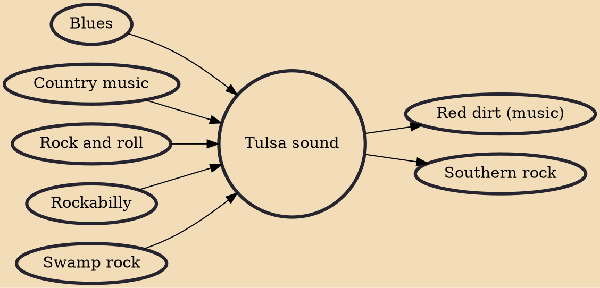

The Tulsa sound is a popular musical style that originated in Tulsa, Oklahoma, during the second half of the twentieth century. It is a mix of blues, blues rock, country, rock and roll and swamp pop sounds of the late 1950s and early 1960s. Artists considered to have pioneered the Tulsa sound include J. J. Cale,Leon Russell, Roger Tillison and Elvin Bishop. After 1980, Gus Hardin(country), and Jeff Carson(country) released roots music albums. Although Dwight Twilley is from Tulsa, his power pop style bears no resemblance to the Tulsa sound; likewise, David Gates' most recognized songs (including his work with Bread) were mostly in the soft rock genre (though some of Gates' solo album cuts show a stronger Tulsa influence).

## Influences

- [[Blues]]
- [[Country music]]
- [[Rock and roll]]
- [[Rockabilly]]
- [[Swamp rock]]

## Derivatives

- [[Red dirt (music)]]
- [[Southern rock]]
